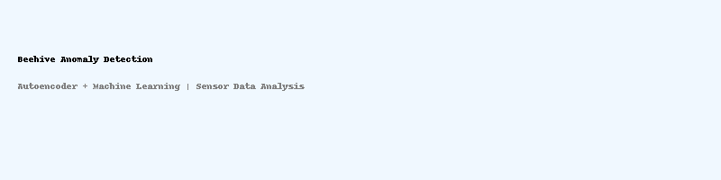

# 🐝 Anomaly-Detection-in-Beehive-Environmental-Data-Autoencoder-ML-Methods-

This project demonstrates anomaly detection in beehive environmental sensor data using both traditional machine learning and deep learning methods.

---

## 🔍 Project Overview

- **Dataset**: Real-world sensor data from a monitored beehive (temperature, humidity)
- **Source**: [Kaggle Dataset - Beehives](https://www.kaggle.com/datasets/vivovinco/beehives/data)
- **Traditional ML Models**:
  - One-Class SVM
  - Isolation Forest
- **Deep Learning**:
  - Autoencoder for unsupervised anomaly detection
- **Output**: Anomalous data points based on reconstruction error and model decision boundaries

---

## 📈 Sample Output

- 📊 MSE histogram to visualize reconstruction errors  
- 🎯 Contour plots to show anomaly decision regions  
- 🧠 Thresholding (95th percentile) to identify anomalies

 ##  🛠️ Future Improvements
 
- Add LSTM Autoencoder for time series anomaly detection
- Deploy as a Streamlit app
- Connect to real-time IoT data streams

